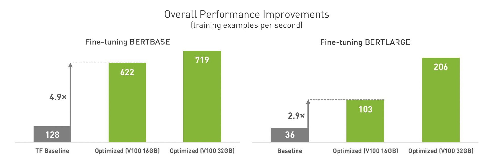

# Fine-tuning BERT


**[BERT](https://arxiv.org/abs/1810.04805)** (Bidirectional Encoder Representations from Transformers) is a state-of-the-art NLP language model. BERT achieves state-of-the-art performance on a wide range of NLP tasks without any task specific architecture. Hence, we can fine-tune BERT or even combine it with other layers to create novel architectures. Since BERT is a large model, we require scaled-up training to iterate swiftly and enable productive experimentation.

In this repository, we provide a performance-optimized examples for training BERT at a single-node, multi-gpu scale. We explain how we deliver at least 2.9× performance improvement (over a baseline implementation) on an NVIDIA DGX-1V, on BERT fine-tuning tasks for both BERTBASE and BERTLARGE. We also show that you can exceed 5× performance improvement by additionally moving from 16GB to 32GB V100 GPUs.



The code in this repository demonstrates:

* Using a [TFHub](https://www.tensorflow.org/hub) BERT module (see [list of BERT modules](https://tfhub.dev/s?q=bert)) wrapped in a Keras layer as a easy way to use BERT in a Keras model. We use Keras to keep the code simple and readable.
* [Performance Enhancements](#performance-enhancements). Applying the XLA compiler and Automatic Mixed Precision (AMP) to speed up BERT training significantly on NVIDIA Tensor Core GPUs.
* [Efficient multi-GPU training](#efficient-scaling-on-multiple-gpus). This is achieved using Horovod. We use FP16 compression and sparse-to-dense tensor conversion during communication to improve scaling performance.
* [Conversion to TensorRT](convert_tensorrt.ipynb) for efficient inference on platforms such as TensorRT Inference Server or TensorFlow Serving.
* See [`FILES.md`](FILES.md) for an overview of the different files and directories contained in this repository.

Note that these benchmarks are run on a DGX-1V on Max-Q (power efficiency) mode, where each V100 is configured to have a TDP of 160W. Hence, the benchmarks provided are not formal guarantees of performance, and your numbers will likely be at least 20% higher.

## BERT Specifics

### Input Pipeline

BERT relies on specific preprocessing for the input sequences. This is described in their [paper](https://arxiv.org/abs/1810.04805). For the examples in this repository, we will use the preprocessing functions that have been adapted from the official GitHub repository ([google-research/bert](https://github.com/google-research/bert)). They are documented and placed in [bert_utils.py](https://github.com/NVAITC/examples/blob/master/bert_finetune/bert_utils.py).

The basic steps in the data input pipeline are:

1. Read the dataset into Python lists
2. Segment the dataset among worker processes
3. Create BERT tokenizer with `create_tokenizer_from_hub_module`
4. Convert Python lists into `InputExample` with `convert_text_to_examples`
5. Convert `InputExample` back into arrays with `convert_examples_to_features`
6. Feed arrays into model during training

You can view a Jupyter notebook that breaks down the process [here](bert_input.ipynb).

### BERT Keras Layer

The BERT layer ([see docstring](https://github.com/NVAITC/bert-finetune/blob/master/bert_utils.py#L10)) can be instantiated easily:

```python
l = bert_utils.BERT(fine_tune_layers=TUNE_LAYERS, # number of cells to tune, "-1" means everything
                    bert_path=BERT_PATH,          # URL of TFHub BERT module
                    return_sequence=False,        # return sequence output for token-level tasks
                    output_size=H_SIZE,           # output/size of hidden representation
                    debug=False)                  # print debug output
```

Here is a simple notebook to demonstrate the instantiation of the of BERT layer: [link](https://github.com/NVAITC/examples/blob/master/bert_finetune/bert_layer.ipynb). Turning on the `debug` flag will cause a printout of the number of layers, as well as the dimensions and parameter count of all trainable variables in the instantiated layer.

Note that there are two main variants of the BERT model described in the paper and available on TFHub: 

| Model     | Hidden layers (L) | Hidden unit size (H) | Attention heads (A) | Feedforward filter size | Max sequence length | Parameters |
| --------- | ------------- | ---------------- | --------------- | ----------------------- | ------------------- | ---------- |
| BERTBASE  | 12 encoder    | 768              | 12              | 4 x  768                | 512                 | 110M       |
| BERTLARGE | 24 encoder    | 1024             | 16              | 4 x 1024                | 512                 | 330M       |

## Performance Enhancements

### Enabling TensorFlow Performance Features

By enabling performance features such as the [XLA](https://www.tensorflow.org/xla/overview) compiler and [Automatic Mixed Precision (AMP)](https://developer.nvidia.com/automatic-mixed-precision), we can get a performance improvement of at least 3x on a DGX-1V system when training BERT.

<p align="center">
  
  
</p>

Using the V100 32GB enables you to at least double the batch size, and thus get much better training throughput for large models like BERTLARGE.

Create a TensorFlow session with AMP and XLA enabled:

```python
config = tf.ConfigProto()
# enable XLA
config.graph_options.optimizer_options.global_jit_level = tf.OptimizerOptions.ON_1
# enable AMP
config.graph_options.rewrite_options.auto_mixed_precision = True
sess = tf.Session(config=config)
tf.keras.backend.set_session(sess)

# (TF 1.x:) Enable Resource Variables to improve efficiency of XLA fusions
tf.enable_resource_variables() 
```

Create the AMP optimizer and use it to compile the Keras model. The AMP optimizer performs dynamic loss scaling to avoid NaN/Inf and gradient underflow problems. You can consult the [relevant TensorFlow documentation](https://www.tensorflow.org/api_docs/python/tf/keras/mixed_precision/experimental/LossScaleOptimizer) to learn more.

```python
opt = tf.keras.mixed_precision.experimental.LossScaleOptimizer(opt, "dynamic")

model.compile(loss="sparse_categorical_crossentropy",
              optimizer=opt,
              metrics=["accuracy"])
```

### Efficient Scaling on Multiple GPUs

BERT has a large number of parameters (110M or 330M), which makes it important to reduce the communication overhead when synchronizing between workers by using a library such as [**Horovod**](https://github.com/horovod/horovod). Horovod uses NCCL (NVIDIA Collective Communications Library) which provides optimized implementation of inter-GPU communication operations, which can leverage the high-performance NVLink or NVSwitch interconnect between GPUs. We can get extremely good scaling efficiency (96%) when using Horovod.

<p align="center">
  
</p>

>If you are new to Horovod or distributed training, please view:
>* [Basic Horovod MPI concepts](https://github.com/horovod/horovod/blob/master/docs/concepts.rst)
>* [Horovod Simple MNIST example](https://github.com/horovod/horovod/blob/master/examples/keras_mnist.py)
>* [NCCL](https://developer.nvidia.com/nccl)

#### Optimal Horovod Configuration

BERT has a large Embedding layer which produces gradients as sparse [`IndexedSlices`](https://www.tensorflow.org/api_docs/python/tf/IndexedSlices) objects. As a result gradients are accumulated via allgather instead of allreduce. We use sparse to dense tensor conversion to force the gradients to be accumulated using allreduce instead, at the cost of increase memory usage. By futher using FP16 compression, we can increase the overall training throughput as measured on a DGX-1V (8 V100 with NVLink).

```python
optimizer = hvd_keras.DistributedOptimizer(optimizer,
                                           compression=hvd.Compression.fp16,
                                           sparse_as_dense=True)
```

<p align="center">
  
  
</p>

Due to the relatively large proportion of parameters being from the Embedding layer, `sparse_as_dense` results in a significant performance boost for BERTBASE, and increases the average NVLink bandwidth significantly for both models. This also results in increase VRAM usage by Horovod as it allocates more VRAM for the allreduce operations. To reduce the required VRAM as well as communication bandwidth, we use FP16 compression. Finally, this also allows us to increase the batch size. Hence, we obtain a dramatic performance increase over the baseline performance (already using XLA+AMP).

<p align="center">
  
  
</p>

#### Impact of NVLink Interconnect (DGX-1V)

When we disable NVLink during model training (`-x NCCL_P2P_DISABLE=1`), communication takes place exclusively over the PCIE bus and training performance drops anywhere from 16% to 44% for the otherwise fully optimized training routine (FP16 compression, `sparse_as_dense=True`, XLA+AMP). 

On a DGX-1V (Max-Q mode) with 32GB V100:

| Model     | Avg NVLink BW | With NVLink    | Without NVLink | Slowdown |
| --------- | ------------- | -------------- | -------------- | -------- |
| BERTBASE  | 3 GB/s        | 719 examples/s | 618 examples/s | 16%      |
| BERTLARGE | 10 GB/s       | 206 examples/s | 143 examples/s | 44%      |

This also leads us to the conclusion that in order for inter-node network bandwidth (not tested) to not be a bottleneck, we require at least 25-gigabit (BERTBASE) or 100-gigabit networking (BERTLARGE). 

### Additional Optimizations

**LazyAdam optimizer**

We can use the LazyAdam optimizer to slightly reduce the VRAM usage of the optimizer. It is a variant of the Adam optimizer that handles sparse gradient updates more efficiently. However, it provides slightly different semantics than the original Adam algorithm, and may lead to different empirical results (in practice there is no real difference).

LazyAdam provides an inconsistent performance boost (depending on model/training configuration) hence we leave it off in most cases. It is provided here as an additional option for the user. We find this useful if you face OOM issues, such as OOM on only during second epoch. 

**Misc TensorFlow Flags**

We additional set the following TensorFlow flags, which might improve or provide more consistent performance on some systems:

```python
# Tensorflow environment variables

# each GPU has dedicated threads to launch kernels
os.environ["TF_GPU_THREAD_MODE"] = "gpu_private"
# two threads per GPU
os.environ["TF_GPU_THREAD_COUNT"] = "2"

# TensorFlow session config

# enable NUMA awareness for multi-socket systems
config.gpu_options.Experimental.use_numa_affinity = True
# use number of physical cores to execute parallelizable CPU ops
config.intra_op_parallelism_threads = multiprocessing.cpu_count()//hvd.size()
config.inter_op_parallelism_threads = multiprocessing.cpu_count()//hvd.size()
```

### Performance Analysis

#### Efficiency of GPU kernels

SOL (Speed Of Light) refers to the theoretical throughput of the GPU. We are able to measure SOL for the individual kernels used during the training process using NSight Compute. Below are the top 3 GPU kernels used and their SOL for compute and memory. There are about 1000+ other kernels (many generated by XLA) that occupy <1% of time each. A general observation is that XLA fusion kernels tend to show very good SOL memory, but poor SOL compute.

| Kernel | Time | %SOL Compute | %SOL Memory |
| ------ | ---- | ------------ | ----------- |
| `volta_fp16_s884gemm_fp16_256x128_ldg8_f2f_nn` | 16% | 37.72 | 37.02 |
| `volta_fp16_s884gemm_fp16_128x256_ldg8_f2f_tn` | 14% | 41.16 | 35.21 |
| `volta_fp16_s884gemm_fp16_256x128_ldg8_f2f_nt` | 13% | 43.94 | 40.42 |
| `volta_fp16_s884gemm_fp16_64x64_ldg8_f2f_tn`   | 2%  | 30.68 | 53.83 |
| `volta_fp16_s884gemm_fp16_64x64_ldg8_f2f_nn`   | 2%  | 36.44 | 68.96 |
| `volta_fp16_s884gemm_fp16_64x64_ldg8_f2f_nt`   | 2%  | 31.84 | 53.02 |
| **Top 6 Kernels**                              | **49%** | **39.77** | **40.05** |

The way to interprete the kernel names are `[arch]_[output_type]_[s|h][gemm|cudnn]_[input_type]_[MxN]_[opt]_[n|t][n|t]`. In particular:

* `884gemm` indicates Tensor Cores (**884**) matrix-multiply (**gemm**)
* `[s|h]` before `gemm` indicates **s**ingle (FP32) or **h**alf precision (FP16) accumulate
* `ldg8` load 8 elements per LDG instruction ("load from global memory")
* `f2f` conversation of float values
* `[n|t]` indicates **n**ormal or **t**ransposed

We are using Tensor Cores at least 49% of the time. Of that 49%, we are at least approxmiately 40% efficient. This means we should be getting at least 23.5 TFLOPS from the Tensor Cores.

We are also able to estimate the model FLOPS during training using [this notebook](model_flops.ipynb). This estimate is a **lower-bound**, as there are some operations that are not accounted for due to lack of information on input shape etc.

The single GPU throughput on a V100 (16GB) GPU on an NVIDIA DGX Station is 102 examples per second for BERTBASE. This works out to >26.8 TFLOPS of performance overall. Hence our numbers seem to be consistent.

The table below represents values recorded on a DGX-1V with 8 V100 (32GB) on Max-Q mode:

| Model     | Examples per second | Effective TFLOPS |
| --------- | ------------------- | ---------------- |
| BERTBASE  | 719                 | > 189.1          |
| BERTLARGE | 206                 | > 192.2          |

## Example Task

### AG News Category Classification

This example demonstrates fine-grained news topic classification with 4 topics. There is a training set of 120000 articles and a test set of 7600 articles. We also limit the sequence length for training to 256 word pieces because a all the articles fall within that.

Run `python3 news_classification.py -h` to see the arguments that you can pass to the training script.

One liner for running in container for remote batch job:

```bash
# example to run on 8 GPUs (e.g. DGX-1)
bash -c 'export N_GPU=8 && git clone --depth 1 https://github.com/NVAITC/bert-finetune && cd bert-finetune && bash train_news_classification_bertbase.sh'
```

#### Classification Performance

| Model      | Params | Test Acc |
| ---------- | ------ | -------- |
| XLNet      | 330M   | 0.955    |
| BERTLARGE  | 330M   | 0.946    |
| BERTBASE   | 110M   | 0.941    |
| CNN (Johnson, 2017) | ? | 0.934    |
| CNN (Zhang, 2015)   | ? | 0.905    |

To get better classification performance, we use learning rate warmup followed by learning rate decay.

Note: As of TF 1.14, learning rate scheduling requires our [custom patch of TensorFlow](https://github.com/NVAITC/tensorflow-patched/releases/tag/1.14.0-patchnv1). If you're using our container [`nvaitc/ai-lab:19.08`](https://cloud.docker.com/u/nvaitc/repository/docker/nvaitc/ai-lab) or newer, the patch is already included.

## Future Work

* Add a learning rate finder
* Continue to add improvements over time

## Acknowledgements

**Core Maintainer**

Timothy Liu / [@tlkh](https://github.com/tlkh)

**References**

* BERT Authors: https://github.com/google-research/bert
* NVIDIA: https://github.com/NVIDIA/DeepLearningExamples/tree/master/TensorFlow/LanguageModeling/BERT
* TensorFlow Transformer Official Implementation: https://github.com/tensorflow/models/tree/master/official/transformer
